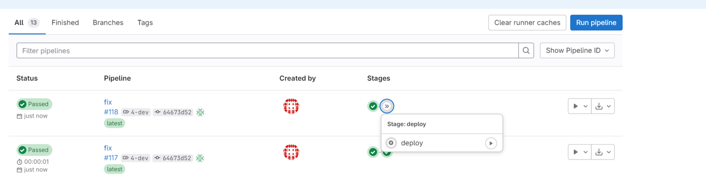

# Проект

Проект сделан на baremetal kubernetes, развернутом в домешней сети.

## Инфтраструктура
Виртуальные машины для кластера и дополнительных сервисов разворачиваются в ProxMox 
на основе заранее подготовленных шаблонов на основе RockyLinux.

Вне проектной работы развернуты следующие сервисы:

- кластер k8s (infra) для инфраструктурных сервисов
- minio (в infra кластере k8s)
- harbor (в infra кластере k8s)
- DNS сервер bind9
- GitLab
- GitLab runner

Сетевая схема (сеть 192.168.31.0/24):

- 200  - DNS, gitlabrunner
- 40   - NFS
- 231  - k8s master1
- 232  - k8s worker1
- 233  - k8s worker2

## Доступные ресурсы

- grafana.avol4kov.ru:34285 - графана
- front.avol4kov.ru:34285 - фронт тестового приложения
- argocd.avol4kov.ru:34285 - арго

## Репозитории

В проекте использовался GitLab в локальной сети, поэтому репозитории на GitHab - копии, реально используемых
### kubernetes_ci

[kubernetes_ci](https://github.com/AV86github/kubernetes_ci)

Репозиторий с кодом GitLab CI для поднятия и настройки кластера k8s \


### kubernetes_makeline_app

[kubernetes_makeline_app](https://github.com/AV86github/kubernetes_makeline_app)

Пример сборки и деплоя приложения. Используется сервис *makeline* из [aks-store-demo](https://github.com/Azure-Samples/aks-store-demo) 

### kubernetes_infra

[kubernetes_infra](https://github.com/AV86github/kubernetes_infra)

- **inventory** - inventory для kubespray
- **app** - пример приложения. (для работоспособности makeline-service вручную запускаются остальные сервисы)
```
k apply -f ./app/mock
```
- **infra** - ArgoApplication инфраструктурных сервисов
- **argo** - сервисы, для которых используется Git Source в ArgoCD

Используется как есть, с GitHub

### argo_repo

[argo_repo](https://github.com/AV86github/argo_repo)

Используется в примере деплоя приложения makeline. \
В процессе деплоя в репозитории обновляется версия образа в Deployment.


## Bootstrap кластера

Для бутстрапа кластера используется GitLab pipeline. \
Кластер создается с использованием kubespray. 

Глобальные переменные:  
- SSH_KEY - ssh ключ. есть во всех VM (добавлен в шаблон)
- CLUSTER_CONFIG - конфиг k8s. \

Переменные пайпа:    

- CLUSTER_BOOTSTRAP - для запуска деплоя кластера через kubespray
- CLUSTER_IPS - IP заранее созданных нод. Кол-во зависит от CLUSTER_SIZE
- CLUSTER_SIZE - размер кластера. В работе использовался tiny (1 master, 2 worker)


Результат kubespray


Каждый инфраструктурный компонент разворачивается через отдельную ручную джобу:


Инфраструктурные компоненты разворачиваются через ArgoCD

Компонент логирования поднимается через helm

```
helm upgrade -i -f ./kubernetes_infra/argo/${module_name}/loki.yaml --set loki.storage.s3.endpoint=${minio_url} --set loki.storage.s3.accessKeyId=${minio_access_key} --set loki.storage.s3.secretAccessKey=${minio_secret_key}  loki --namespace=logging --create-namespace grafana/loki --version 6.7.1
helm upgrade -i -f ./kubernetes_infra/argo/${module_name}/promtail.yaml  promtail --namespace=logging --create-namespace grafana/promtail --version 6.16.4
```


## CICD приложения
В качестве примера приложения используется [Amazon aks store](https://github.com/Azure-Samples/aks-store-demo)

Все сервисы кроме makeline развернуты вручную.

Сборка и деплой приложения настроены только для 1 сервиса - makeline.

Исходники и GitLabCI [kubernetes_makeline_app](https://github.com/AV86github/kubernetes_makeline_app)

Сборка запускается по тегам - *-dev или *-release \
Результат сборки публикуется в локальном Harbor.

Для деплоя необходимо запустить ручной шаг deploy. При этом происходи обновление версии в 
манифесте [kubernetes_makeline_app](https://github.com/AV86github/kubernetes_makeline_app/makeline-service)
в каталоге dev или prod, в зависимости от тега.

В кластер приложение поднимает argocd. Т.к. кластер 1, то dev\prod разделяются по namespace, ео предполагаются что за каталогами dev\prod должны следить ArgoCD в соответствующих кластерах.




## Допущения

- переменная *CLUSTER_CONFIG* в гитлабе задается после создания кластера.
- если приложение деплоится через ArgoApplication и values задается внутри application, то для обновления нужно руками править через UI.
- TLS не использовался.